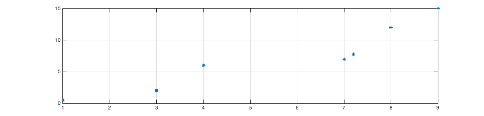
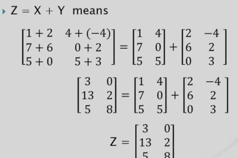

Author  : Tarek Allam Jr. %newline
Date    : 2016-01-29

Chapter 1
=========

 - To clear the workspace - clear<CR> or can just clear a single variable by
   typing clear <variable><CR>
- To clear the screen, simply type clc (clear command window)

- By pressing up arrow, it will show the command history. There is a button in
  the top right hand corner of this window. Click it to show options that can
allow us to put the command window in the dock.

- To save the workspace for use later we simply type save command. This saves
  everything in a .m file format which can be loaded again via the load command.

- Variable names cannot be more than 64 characters long and must not start with
  a number or underscore.

- We can use three dots at then end of a line to carry the command onto the next
  line, like so: something_something = something_something_else /...
something_otherthan

- We can 'dock' the plot by clicking the curved arrow in the top right hand
  corner of the plot. This is useful if we do not want it to disappear to the
back when we click in the command window again.

- doc plot, help plot, search bar at the top.

- ans holds the most recent answer as a variable if the calculation has not be
  assigned to anything else.

- A vector is just an ordered list of numbers. Length of a vector is the sum of
  the square roots of the elements. MATLAB function called norm works this out.

length(<vectorname>);

vector is much like an array.

Plotting
--------

>> xvector = [1, 3, 4, 7, 7.2, 8, 9]
xvector =
    1.0000    3.0000    4.0000    7.0000    7.2000    8.0000    9.0000
>> yvector = [0.5, 2, 6, 7, 7.8, 12, 15]
yvector =
    0.5000    2.0000    6.0000    7.0000    7.8000   12.0000   15.0000
>> plot(xvector, yvector);
>> plot(xvector, yvector, 's');
>> grid on

plot(xvector, yvector, 'rs');
grid on
xlabel('Selection')
ylabel('Change')
title('Changes in selections during the past year')
axis([0, 12, -10, 20])
bar(xvector, yvector)

Can type figure to get new figure, i.e instead of over writing the old one.

To close a figure we can use close(#ofFig) OR. close all command.

pic = imread('filename')
image(pic)
axis off

quit

Chapter 2
=========

Matrices are "said" rows before columns!

Array: Any set of numbers arranged in a rectangular pattern.

i, j, k -> Like, i rows, j columns and k pages (3rd dimension)

* A 2D array = Matrix
* A 1D array = Vector

xvector = [1, 2, 3]

twoBYthreeMATRIX = [0 1 -1; 2.5 pi 100] - 2 rows, 3 columns

size(MATRIX) -> gives dimension of matrix

A scalar is just/can be though of as a 1x1 matrix.

row vector
x = [1 3 7] - 1x3

column vector
y = [1;3;7] - 3x1

**Colon operator**

1:3:7 -> start, step, stop.

Same as: colon(1, 3, 7) OR colon(1, 7) where the second one is say go from 1 to
7
We can also go in reverse, like 7:-3:1 and colon(7, -3, 1)

Accessing Matrices
------------------

X(row, column)

X(row, [list of which columns])

X([list of which rows], columns)

X([list of which rows], [list of which columns])

X(2, end) - gives the last index

1:end == (:)

Combining Matrices
-----------------

Arrays have to be rectangular.

H'(m, n) = H(n, m) for all m and n

So,

H = [1 2 3;4 5 6]

G = H'

G =
1 4
2 5
3 6

Arithmatic
----------

Array addition needs the same dimensions.

Array multiplication A .\* B, element wise operations. But this is actually
quite different to Matrix multiplication.

1. Operator has no dot (\* instead of .\*)
2. Operand must be "compatible" as opposed to simlply having the same shape.
3. Calculation of each element of Z uses both multiplication AND addition.

Chapter 3
=========
Functions
---------

Can click New, function if editor window open.

whos command

Chapter 4
=========

Random Sequence Initialisation
------------------------------

- When we start MATLAB and call rand, it always returns the same exact number:
  0.8147

- Pseudo random number generator: Initialisated at startup and it generates the
  exact same sequence of numbers every time.

- Repeatability for testing the program while we are developing it: good!

- What is we want a sequence that is different from the default or "truly"
  random numbers? Intiialise the MATLAB pseudo random number generator with the
built-in function rng

Chapter 5
========

Variable number of function arguments.
--------------------------------------

Polymorphic functions are functions that behanve differently based on number of
input or output arguments, or type of input or output arguments.

Many built in functions are Polymorphic (sqrt, max, size, plot, etc.)

How do we make our functions Polymorphic?

